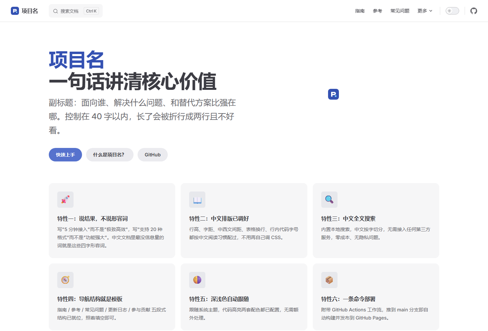

# vitepress-zh-starter

> 面向中文开源项目的 VitePress 文档站起步模板。
> 中文排版、界面文案、搜索分词、导航结构、自动部署——开箱就是中文项目该有的样子。

`VitePress` `中文文档` `文档模板` `Chinese` `Documentation` `MIT`




---

## 它解决什么问题

用 VitePress 默认配置搭中文文档站，你一定会遇到这四件事：

| 问题 | 默认主题的表现 | 本模板的处理 |
| --- | --- | --- |
| 中文行高偏紧 | 按英文调的 `1.5`，中文长文读起来发闷 | 调到 `1.75`，段间距同步放大 |
| 中西文黏连 | `使用VitePress构建` 挤成一团 | CSS 自动加约 1/4 字宽间隙 |
| 界面文案是英文 | `TIP` `Search` `Prev` `Next` | 全部中文化 |
| 中文搜索不可用 | 英文分词方案对中文几乎失效 | 本地搜索按字切分，零依赖 |

还有一个不算问题但很烦的：**每换一个项目，这些都要重新配一遍**。

这个模板把它们固化下来了。

## 和"直接用 VitePress"的区别

**没有引入任何额外依赖**，`package.json` 里只有 `vitepress` 一个包。
所有改动都是配置 + 一个 CSS 文件：

```text
docs/.vitepress/
├─ config.mts              # 中文导航、搜索、界面文案、容器标题
└─ theme/
   ├─ index.ts             # extends DefaultTheme，不重写主题
   └─ zh-typography.css    # 中文排版样式 ★ 唯一的核心文件
```

- 沿用官方默认主题 → VitePress 升级不会失效
- 排版改动集中在一个 CSS 文件 → 删掉即恢复官方外观
- 无第三方插件 → 构建快、无供应链风险

## 快速开始

```bash
git clone https://github.com/bluetn514/vitepress-zh-starter.git my-docs
cd my-docs

# 方式二：直接下载 zip 解压

# 安装并启动
pnpm install
pnpm dev
```

浏览器打开 `http://localhost:5173`。

## 目录结构

```text
├─ docs/
│  ├─ .vitepress/
│  │  ├─ config.mts              # 站点全部配置
│  │  └─ theme/
│  │     ├─ index.ts
│  │     └─ zh-typography.css    # 中文排版（核心）
│  ├─ public/                    # 图片、logo
│  ├─ guide/                     # 使用指南
│  │  ├─ index.md  installation.md  quickstart.md
│  │  ├─ structure.md  deployment.md  customize.md
│  │  └─ writing/                # 中文写作规范
│  │     ├─ typography.md        #   排版：空格、标点、代码块
│  │     ├─ terminology.md       #   术语：大小写、统一用词
│  │     └─ tone.md              #   语气：结论先行、去掉情绪词
│  ├─ reference/                 # 配置速查、Markdown 扩展
│  └─ index.md  faq.md  changelog.md  contributing.md  links.md
├─ .github/workflows/deploy.yml  # 推送 main 即自动部署
├─ preview/                      # README 展示截图
├─ LICENSE
└─ package.json
```

## 文档里有什么

不只是骨架，**写作规范部分是实际可用的内容**：

- **排版规范** — 中西文空格、全角标点、代码块标注语言、表格列数控制、段落长度
- **术语与用词** — 产品名大小写对照表（`GitHub` 不是 `Github`）、哪些词该翻译哪些不该
- **写作语气** — 去掉"强大/优雅/丝滑"、结论先行、三类读者的分层策略
- **部署指南** — `base` 路径配错的症状与排查（中文文档站报障第一名）
- **常见问题** — 可直接改成自己项目的 FAQ 骨架

## 换成你自己的内容

这个仓库的站点信息已经指向本项目自身。如果你要拿它作为**自己项目**的文档站，
按下面三步替换，或者直接 fork 后修改。

### 1. 替换站点信息

`docs/.vitepress/config.mts`：

```ts
title: '你的项目名',
description: '一句话描述',
themeConfig: {
  editLink: {
    pattern: 'https://github.com/你的用户名/你的仓库名/edit/main/docs/:path'
  },
  socialLinks: [
    { icon: 'github', link: 'https://github.com/你的用户名/你的仓库名' }
  ]
}
```

### 2. 确认 base 路径

模板会自动从 CI 环境推导，**通常不用改**。自定义域名时写 `base: '/'`。
详见 [部署指南](docs/guide/deployment.md)。

### 3. 发布前自检

- [ ] `title`、`description` 已替换
- [ ] `editLink.pattern`、`socialLinks` 里的仓库地址已替换
- [ ] 首页 Hero 的按钮指向真实页面
- [ ] `LICENSE` 里的版权信息已替换
- [ ] `pnpm build` 通过（模板开了死链检测，链接写错会直接拦住）
- [ ] `pnpm preview` 检查样式与路径正常
- [ ] 删掉的示例页面对应的侧边栏条目也删了

### 4. 部署

推送到 `main` 分支即自动发布。仓库 Settings → Pages → Source 选
**GitHub Actions**。详见 [部署指南](docs/guide/deployment.md)。

## 常用命令

| 命令 | 作用 |
| --- | --- |
| `pnpm dev` | 启动开发服务器，热更新 |
| `pnpm build` | 构建静态文件（含死链检测） |
| `pnpm preview` | 本地预览构建结果，验证 `base` 路径 |

## 发布到 GitHub

完整的从零发布流程见 [PUBLISHING.md](PUBLISHING.md)：环境准备、认证配置、
仓库创建、推送、开启自动部署、Topics 设置、排错表、发布前检查清单。

## 设计取舍

| 决定 | 原因 |
| --- | --- |
| 不引入任何第三方插件 | 构建快、无供应链风险、升级不失效 |
| 主题用 `extends` 而非重写 | 跟随 VitePress 官方更新 |
| 排版集中在单个 CSS 文件 | 可随时回退到官方默认外观 |
| 不内置评论系统 | 评论区需要长期维护，小项目开了反而伤信任 |
| 不内置多语言 | 没有稳定英文贡献者时，半成品英文站更伤信任 |
| 开启死链检测 | 中文文档链接写错很常见，构建时拦住最省事 |

## 已知限制

- `text-spacing-trim` 在部分旧版浏览器不生效，中西文间距仍建议手动加空格
- 孤立页面（存在但未写入侧边栏）不会被死链检测发现，只能靠人工留意
- 模板只覆盖"通用中文文档站"，不包含 API 自动生成（需配合 TypeDoc 等工具）

## 许可

- 模板代码：[MIT](LICENSE)
- 文档内容：建议采用 [CC BY 4.0](https://creativecommons.org/licenses/by/4.0/deed.zh)，
  便于他人转载时保留署名

---

如果这个模板帮你省下了配环境的时间，一个 Star 就是最直接的反馈。
