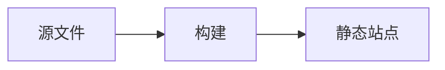

# 进阶定制

模板只做了"中文项目必需"的部分，剩下按需加。下面几项是中文文档站最常被加的功能。

## 一、自定义主题色

在 `docs/.vitepress/theme/zh-typography.css` 末尾追加：

```css
:root {
  --vp-c-brand-1: #3451b2;   /* 主色：链接、强调 */
  --vp-c-brand-2: #3a5ccc;   /* 悬停 */
  --vp-c-brand-3: #5672cd;   /* 边框 */
  --vp-c-brand-soft: rgba(100, 108, 255, 0.14);
}

.dark {
  --vp-c-brand-1: #a8b1ff;
  --vp-c-brand-2: #5c73e7;
  --vp-c-brand-3: #3e63dd;
}
```

改品牌色时**深浅两套都要给**，否则深色模式下链接会看不清。

## 二、首页按钮配色

```css
:root {
  --vp-button-brand-bg: var(--vp-c-brand-1);
  --vp-button-brand-hover-bg: var(--vp-c-brand-2);
}
```

## 三、加 Giscus 评论

中文开源项目用 Giscus（基于 GitHub Discussions，不需要自建后端）。

1. 在 [giscus.app](https://giscus.app/zh-CN) 按引导生成配置
2. 新建 `docs/.vitepress/theme/components/Comments.vue`：

```vue
<script setup>
import { onMounted, watch, nextTick } from 'vue'
import { useData, useRoute } from 'vitepress'

const route = useRoute()
const { isDark } = useData()

function loadGiscus() {
  const el = document.getElementById('giscus-container')
  if (!el) return
  el.innerHTML = ''

  const s = document.createElement('script')
  s.src = 'https://giscus.app/client.js'
  s.async = true
  s.crossOrigin = 'anonymous'
  // 下面这些值从 giscus.app 生成后复制过来
  s.setAttribute('data-repo', '用户名/仓库名')
  s.setAttribute('data-repo-id', 'R_xxx')
  s.setAttribute('data-category', 'Announcements')
  s.setAttribute('data-category-id', 'DIC_xxx')
  s.setAttribute('data-mapping', 'pathname')
  s.setAttribute('data-lang', 'zh-CN')
  s.setAttribute('data-theme', isDark.value ? 'dark' : 'light')
  el.appendChild(s)
}

onMounted(loadGiscus)
watch(() => route.path, () => nextTick(loadGiscus))
watch(isDark, () => nextTick(loadGiscus))
</script>

<template>
  <div class="giscus-wrapper">
    <div id="giscus-container" />
  </div>
</template>

<style scoped>
.giscus-wrapper {
  margin-top: 48px;
  padding-top: 24px;
  border-top: 1px solid var(--vp-c-divider);
}
</style>
```

3. 改 `theme/index.ts` 挂载到每页底部：

```ts
import DefaultTheme from 'vitepress/theme'
import { h } from 'vue'
import Comments from './components/Comments.vue'
import './zh-typography.css'

export default {
  extends: DefaultTheme,
  Layout() {
    return h(DefaultTheme.Layout, null, {
      'doc-after': () => h(Comments)
    })
  }
}
```

::: warning 评论是双刃剑
开了评论就要维护。长期没人回复的评论区比没有评论区更伤信任，
小项目建议先不开，用 GitHub Issues 承接反馈。
:::

## 四、Mermaid 流程图

中文文档常需要架构图。VitePress 不内置 Mermaid，用社区插件或手动加：

```bash
pnpm add -D vitepress-plugin-mermaid mermaid
```

```ts
// config.mts
import { withMermaid } from 'vitepress-plugin-mermaid'

export default withMermaid(
  defineConfig({
    // ...原配置
  })
)
```

之后直接用：

````md

````

::: tip 插件会拖慢构建
Mermaid 体积大，文档里图表少于 5 张的话，
建议直接导出 PNG/SVG 图片放 `docs/public/`，更快更稳。
:::

## 五、i18n 多语言

VitePress 的 i18n 采用**目录分语言**的方案：

```text
docs/
├─ index.md          # 中文（根路径，zh-CN）
├─ en/
│  └─ index.md       # 英文
```

```ts
// config.mts
export default defineConfig({
  locales: {
    root: {
      label: '简体中文',
      lang: 'zh-CN',
      themeConfig: { /* 中文导航与侧边栏 */ }
    },
    en: {
      label: 'English',
      lang: 'en-US',
      link: '/en/',
      themeConfig: { /* 英文导航与侧边栏 */ }
    }
  }
})
```

::: warning 多语言的真实成本
不是配置成本，是**翻译维护成本**。中文文档更新后英文版不同步，
反而会让英文用户看到过时内容。
项目没有稳定英文贡献者时，**建议只做中文**，比做半个英文站更好。
:::

## 六、加站长统计

中文项目常用百度统计或 Umami（可自托管）。

```ts
// config.mts 的 head 里加
head: [
  ['script', { async: true, src: 'https://your-analytics.com/script.js', 'data-website-id': 'xxx' }]
]
```

::: tip 优先选无 Cookie 方案
国内外隐私合规趋严，用不落 Cookie 的统计工具（如 Umami、Plausible）
可以省掉一堆同意弹窗。
:::

## 七、加文档质量 CI

把术语一致性检查加进工作流：

```yaml
# .github/workflows/docs-lint.yml
name: 文档检查
on: [pull_request]
jobs:
  lint:
    runs-on: ubuntu-latest
    steps:
      - uses: actions/checkout@v4
      - name: 检查产品名大小写
        run: |
          if grep -rn -E "\b(Github|Javascript|Nodejs|NPM|MacOS)\b" docs/ --include="*.md"; then
            echo "::error::发现大小写错误的产品名，见上方输出"
            exit 1
          fi
```

这条检查能长期防住中文文档最顽固的一类错误。

## 八、不可添加的东西

| 别加 | 原因 |
| --- | --- |
| 自动播放的背景音乐 | 移动端会直接关闭页面 |
| 全屏滚动动画 | 破坏文档的可检索性 |
| 章节阅读进度弹窗 | 打断阅读，收益为零 |
| 强制登录才能看 | 文档是给人看的，不是获客漏斗 |
